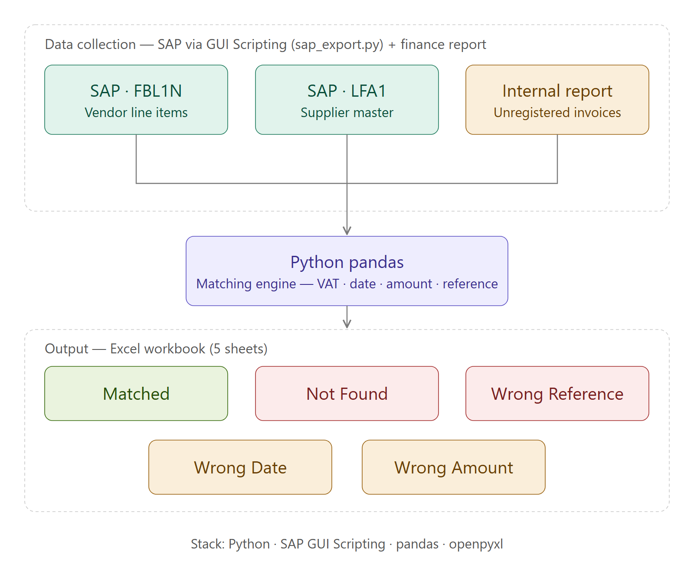

# Supplier Invoice Reconciliation Engine

Automated reconciliation engine that matches unposted supplier invoices against internal SAP records, identifying discrepancies and categorizing them for review.


## Workflow



## Business Problem

In large manufacturing environments, supplier invoices submitted to tax authorities (myDATA) must be matched against internal SAP postings. This process was previously done manually — cross-referencing thousands of entries across multiple Excel files, which was time-consuming and error-prone.

This engine automates the entire matching process and produces a structured output that accountants can review immediately.

## How It Works

### Input
| File | Source | Description |
|---|---|---|
| `ΕΛΒΑΛ.xlsx` | SAP export (Power Automate Desktop) | Internal posted transactions |
| `ΠΡΟΜΗΘΕΥΤΕΣ.xlsx` | SAP export (Power Automate Desktop) | Supplier master data (VAT lookup) |
| `ΑΚΑΤΑΧΩΡΗΤΑ.xlsx` | Finance team (shared folder) | Combined ELVAL + HALCOR unposted entries |

> In production, `ΕΛΒΑΛ.xlsx` and `ΠΡΟΜΗΘΕΥΤΕΣ.xlsx` are exported from SAP automatically by [`sap_export.py`](sap_export.py), using the **SAP GUI Scripting API** — eliminating manual data collection entirely.

### SAP export (`sap_export.py`)

Originally a Power Automate Desktop flow (recorded clicks and `SendKeys` — [previous workflow](legacy/workflow_pad.png)); now driven by element IDs through SAP GUI Scripting:

- **Supplier master** — LFA1 through a table-display transaction, in display mode only → Excel
- **Vendor line items** — FBL1N with vendor ranges (multiple selection), company code, all items, posting-date window and a saved layout → Excel
- One login for both exports, a system-wide mutex so no two SAP automations collide, credentials from the Windows Credential Manager, nothing ever saved in SAP

Production lessons built in:

| Problem seen in production | Handling |
|---|---|
| The table export answered *"File does not exist"* | It only overwrites existing files → an empty workbook is created first and the script waits for it to **change** |
| Export target with non-ASCII folder/file names | SAP writes to an ASCII temp folder; Python moves the file to its final name |
| ~27k-row table arrives in packages, *"memory low"* warning | Export starts only after the grid holds every row from the window title |
| A previous run's file could be mistaken for the new one | Completion = modification time changed **and** size stopped growing |
| Failures were hard to diagnose | Each step logs the status bar, open windows and the dialog fields as SAP reads them back |

### Matching Logic

Each unposted entry is matched against SAP records on **4 keys**: VAT ID, Date, Amount, Reference Number.

| Result | Condition |
|---|---|
| ΒΡΕΘΗΚΑΝ | All 4 keys match exactly |
| ΛΑΘΟΣ ΑΞΙΑ | VAT + Date + REF match, Amount differs |
| ΛΑΘΟΣ ΗΜΕΡΟΜΗΝΙΑ | VAT + Amount + REF match, Date differs |
| ΛΑΘΟΣ ΑΝΑΦΟΡΑ  |  VAT + Amount + Date match, Reference differs |
| ΔΕΝ ΒΡΕΘΗΚΑΝ | No SAP record found (likely HALCOR entries) |

### Reference Number Matching

Suppliers often submit reference numbers in different formats than internal SAP records (e.g. supplier sends `2024001`, SAP stores `TIM-2024-2024001`). The engine strips non-numeric characters and uses a **contains** check to handle this automatically.

### Output

`MATCHING_RESULT.xlsx` with 5 sheets — one per category — formatted as Excel tables with auto-fitted columns.

## Tech Stack

- Python 3
- pandas
- openpyxl
- SAP GUI Scripting (win32com) — `sap_export.py`, Windows + SAP GUI only

## Usage

```bash
pip install pandas openpyxl
python MATCHING_REPORT_PORTFOLIO_FULL.py
```

The script runs in two phases:
1. **Phase 1** — generates dummy data (simulates SAP exports and supplier file)
2. **Phase 2** — runs the reconciliation engine and produces `MATCHING_RESULT.xlsx`

## Sample Output

| NAME | VAT | REF | AMOUNT | DATE | SAP_DOC_ID | SAP_REF | SAP_AMOUNT | SAP_DATE |
|---|---|---|---|---|---|---|---|---|
| ALPHA INDUSTRIES SA | 123456789 | 5915 | 2397.74 | 26/11/2024 | SAP0056 | TIM-2024-5915 | 2397.74 | 26/11/2024 |
| BETA TRADING SA | 987654321 | 4295 | 13969.25 | 21/08/2024 | SAP0031 | TIM-2024-4295 | 13969.25 | 19/12/2024 |

## Author

Petros Vachaviolos — Business Intelligence & Process Automation Specialist

[LinkedIn](https://www.linkedin.com/in/petros-vachaviolos)
